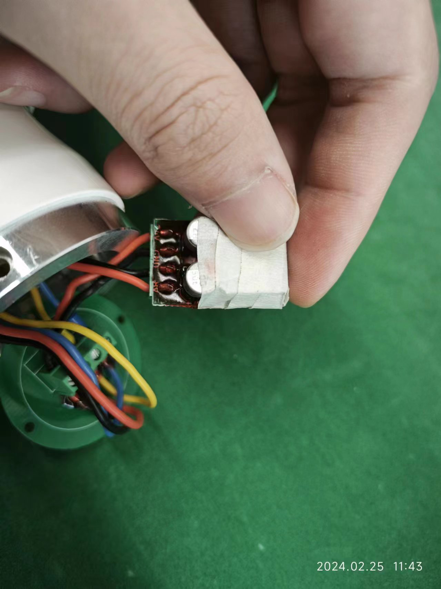
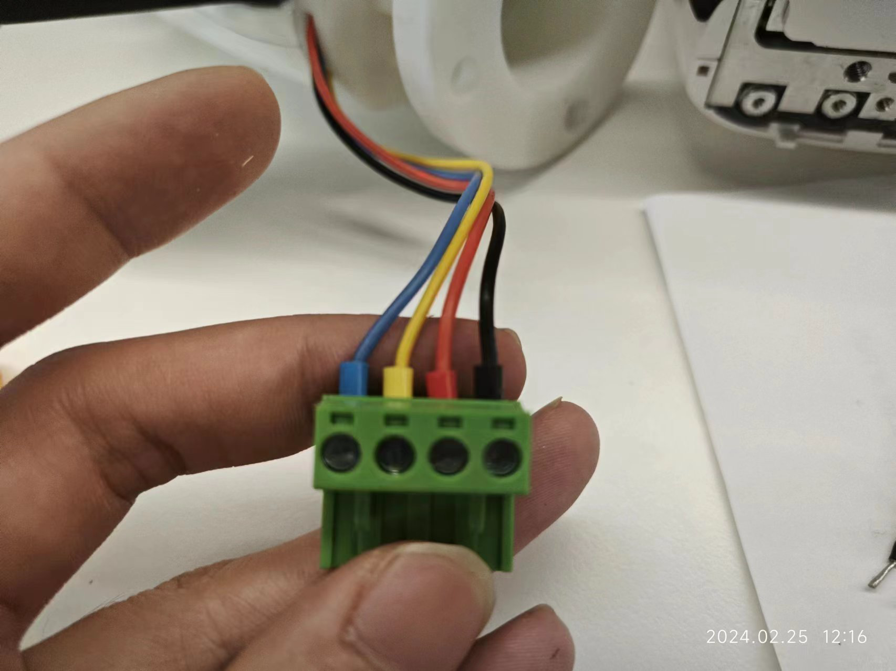

# 灵巧手使用说明

## 硬件

### 接口与线序

由于因时灵巧手长度过长，部分灵巧手存在拆除下半部分的情况，以下简称为“手腕”。未拆掉手腕的灵巧手线序与接口如图所示：
<div align=center>

</div>
注意：

- 通过手腕接口接入灵巧手的`VCC`输入为`24V`，经过一个降压板后转为`7-9V`，降压板如图所示：
<div align=center>

</div>
- 用于双臂倒茶`demo`的灵巧手为`RS232`的通信方式

拆掉手腕后，灵巧手的线序如下图和下表所示：
如图所示：

<div align=center>

</div>

| 线路颜色 |   引脚定义    |
| :------: | :-----------: |
|    黑    |     `GND`     |
|    红    | `VCC（7-9V）` |
|    黄    |  `RS485 A+`   |
|    蓝    |  `RS485 B-`   |

部分灵巧手(云深处的灵巧手)可能存在颜色不同的情况，可参考下表：

| 线路颜色 |   引脚定义    |
| :------: | :-----------: |
|    黑    |     `GND`     |
|    红    | `VCC（7-9V）` |
|    白    |  `RS485 A+`   |
|    灰    |  `RS485 B-`   |

## 控制灵巧手

### 上位机（Windows）

上位机与上位机操作说明下载网址：https://www.inspire-robots.com/download/frwz/

注意：

- 在确保通信线路无问题的情况下，可能会出现无法连上的情况，此时可以尝试重新插拔灵巧手的电源和串口。
- 部分灵巧手可能存在修改波特率的情况，在连接时请尝试多种波特率。

### 快速开始

```bash
# git clone 
git clone https://github.com/MickyFlowers/inspire_hand.git -b fd_version
```

原先因时灵巧手的驱动采用`ros serial`与硬件进行通信，在使用时可能会出现断连（需要重新插拔接头）、无法控制等情况，同时，原先的代码只能以`ros service`的形式运行，难以在代码中单独调用。该分支`fd_version`采用`c++`标准库直接对文件进行读写，采用阻塞的方式接受灵巧手数据，并能够控制但个设备总线上的所有灵巧手。

由于该驱动缺乏大量测试，可能存在以下问题：

- 串口通信错位问题

使用你喜欢的编辑器，将`inspire_hand.hpp`包括进你的代码中：

```c++
#include "inspire_hand.hpp"
```

在代码中实例化一个`inspire_hand::InspireHandSerial`对象，传入端口和波特率，即可初始化inspire_hand的总线端口，例如：

```c++
inspire_hand::InspireHandSerial inspire_hand_serial("/dev/ttyUSB0", 115200);
```
关节索引为：

| 索引 | 0      | 1      | 2    | 3    | 4             | 5           |
| ---- | ------ | ------ | ---- | ---- | ------------- | ----------- |
| 关节 | 小拇指 | 无名指 | 中指 | 食指 | 大拇指`pitch` | 大拇指`yaw` |

控制灵巧手关节：

```c++
inspire_hand_serial.setAngle(1, {500, 500, 500, 500, 500, 0});
```

读取灵巧手反馈，首先需要获取指向某一`id`灵巧手成员变量`fdb_`的指针，查询该成员变量值：

```c++
inspire_hand::InspireHand::fdb *fdb = inspire_hand_serial.getInspireHandFeedback(1);
std::cout << fdb->angle << std::endl;
```

清除灵巧手错误码：

```c++
inspire_hand_serial.clearError(1);
```

#### `InspireHand`类

##### public

###### 结构体

| 名称  | 参数说明                                                     | 描述                 |
| :---- | :----------------------------------------------------------- | :------------------- |
| `cmd` | `set_id`：设置灵巧手id号<br />`baudrate`：设置灵巧手波特率<br />`current_limit`：设置灵巧手电流限制<br />`default_speed`：设置灵巧手上电默认速度<br />`default_force_threshold`：设置灵巧手上电默认力控阈值<br />`pos`：设置灵巧手电缸位置<br />`angle`：设置灵巧手关节角度<br />`force_threshold`：设置灵巧手力控阈值<br />`speed`：设置灵巧手运动速度 | 灵巧手控制命令结构体 |
| `fdb` | `error_code`：灵巧手错误码反馈值<br />`status`：灵巧手状态反馈值<br />`temperature`：灵巧手温度反馈值<br />`speed`：灵巧手速度反馈值<br />`pos`：灵巧手电缸位置反馈值<br />`angle`：灵巧手关节角度反馈值<br />`force`：灵巧手关节力反馈值<br />`current`：灵巧手电流反馈值<br />`pos_set`：灵巧手电缸位置设定值<br />`angle_set`：灵巧手关节角度设定值<br />`force_set`：灵巧手力控阈值设定值 | 灵巧手反馈值结构体   |

###### 枚举类型

| 名称        | 枚举                                                         | 描述                   |
| ----------- | ------------------------------------------------------------ | ---------------------- |
| `CmdType_e` | `SetId`<br />`SetBaudrate`<br />`ClearError`<br />`SaveFlash`<br />`Reset`<br />`ForceCalibration`<br />`SetCurrentLimit`<br />`SetDefaultSpeed`<br />`SetDefaultForceThreshold`<br />`SetPos`<br />`SetForceThreshold`<br />`SetSpeed`<br />`GetPos`<br />`GetAngle`<br />`GetForce`<br />`GetCurrent`<br />`GetError`<br />`GetStatus`<br />`GetTemperature`<br />`GetPosSet`<br />`GetAngleSet`<br />`GetForceSet` | 灵巧手控制命令枚举类型 |

##### private

###### 成员变量

| 名称         | 描述                 |
| :----------- | :------------------- |
| `boundrate_` | 灵巧手波特率         |
| `id_`        | 灵巧手`id`           |
| `fdb_`       | 灵巧手反馈结构体变量 |
| `cmd_`       | 灵巧手控制命令结构体 |

###### 方法

| 名称       | 参数说明                                                     | 描述                                                         |
| ---------- | ------------------------------------------------------------ | ------------------------------------------------------------ |
| `encode`   | `CmdType_e command_type`：控制命令枚举类型                   | 对成员变量`cmd_`中的变量进行编码，指定编码类型，返回`vector<uint8_t>`容器 |
| `decode`   | `CmdType_e command_type`：控制命令枚举类型<br />`data`：所需解码的数据，`vector<uint8_t>`类型 | 将`data`解码到成员变量`fdb_`中                               |
| `checksum` | `data`：计算校验码的输入                                     | 计算校验码                                                   |

#### `InspireHandSerial`类

##### 方法

以下方法均需指定总线上的灵巧手`id`，在参数说明中省略：

| 名称                       | 参数说明                                | 描述                                       |
| -------------------------- | --------------------------------------- | ------------------------------------------ |
| `setId`                    | `set_id`：灵巧手设置的`id`              | 设置灵巧手`id`                             |
| `setAngle`                 | `angle`：设置关节角度                   | 设置灵巧手关节角度                         |
| `setBaudrate`              | `baudrate`：波特率                      | 设置灵巧手波特率                           |
| `clearError`               | `/`                                     | 清除灵巧手错误                             |
| `saveFlash`                | `/`                                     | 将数据写入`flash`                          |
| `forceCalibration`         | `/`                                     | 校准力传感器                               |
| `setCurrentLimit`          | `current_limit`：电流限制               | 设置电流限制                               |
| `setDefaultSpeed`          | `default_speed`：上电默认速度           | 设置上电默认速度                           |
| `setDefaultForceThreshold` | `default_force_threshold`：设置关节角度 | 设置上电默认力控阈值                       |
| `setPos`                   | `pos`：设置关节角度                     | 设置电缸位置                               |
| `setForceThreshold`        | `force_threshold`：设置关节角度         | 设置力控阈值                               |
| `setSpeed`                 | `speed`：设置关节角度                   | 设置速度                                   |
| `getPos`                   | `/`                                     | 获取电缸位置                               |
| `getForce`                 | `/`                                     | 获取关节力                                 |
| `getCurrent`               | `/`                                     | 获取电流值                                 |
| `getError`                 | `/`                                     | 获取错误码                                 |
| `getStatus`                | `/`                                     | 获取灵巧手状态                             |
| `getTemperature`           | `/`                                     | 获取灵巧手温度                             |
| `getPosSet`                | `/`                                     | 获取电缸位置设定值                         |
| `getAngleSet`              | `/`                                     | 获取关节角度设定值                         |
| `getForceSet`              | `/`                                     | 获取力控阈值设定值                         |
| `getInspireHandFeedback`   | 返回：`InspireHand::fdb`                | 获取某一`id`灵巧手指向`fdb_`成员变量的指针 |

### ROS Package

使用以下命令克隆因时灵巧手的`ros package`并用你喜欢的编译命令对其进行编译：

```bash
# git clone 
git clone https://github.com/MickyFlowers/inspire_hand.git -b fd_version
# build
catkin build
```

运行灵巧手的文件为`inspire_hand_server.launch`，文件内容如下所示：

```yaml
<?xml version="1.0" ?>
<launch>
  <arg name="port" default= "/dev/ttyUSB0" />
  <arg name="baudrate" default= "115200" />
  <node name="inspire_hand_server" pkg="inspire_hand" type="inspire_hand_server" output="screen" >
    <param name = "port" value="$(arg port)" />
    <param name = "baudrate" value="$(arg baudrate)" />
  </node>
</launch>
```

该`launch`文件启动了端口并能够控制总线上所有的灵巧手运行命令：

```bash
roslaunch inspire_hand inspire_hand_server.launch port:="/dev/ttyS1" baudrate:=115200
```

该节点以`ROS Service Server`的形式运行，可以在命令行中查看所有可调用的服务：

```bash
rosservice list
```

以写`id`=1的灵巧手关节数据为例：

```bash
# 写(angle1-6替换为0-1000的数即可改变灵巧手关节角度值)
rosservice call /right_inspire_hand/set_angle id angle1 angle2 angle3 angle4 angle5 angle6
```

